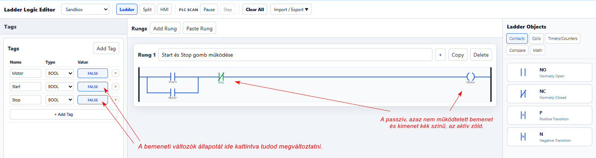

# 1. Start–Stop és öntartás

Ebben a leckében egy alapvető PLC-vezérlést készítünk el: a Start–Stop kapcsolást öntartással.

## Cél

A feladat végére megérted:

- a Start nyomógomb szerepét,
- a Stop nyomógomb szerepét,
- az öntartás működését,
- a kimenet be- és kikapcsolását.

## Feladat

Készíts olyan vezérlést, amelyben:

- a `Start` gomb megnyomására a kimenet bekapcsol,
- a Start gomb elengedése után is bekapcsolva marad,
- a `Stop` gomb megnyomására a kimenet kikapcsol.

## Megoldás

## Működés

A `Start` nyomógomb megnyomásakor a kimenet bekapcsol.

A kimenet saját segédérintkezője párhuzamosan kapcsolódik a Start nyomógombbal, ezért a Start elengedése után is fenntartja a működést. Ezt nevezzük **öntartásnak**.

A `Stop` nyomógomb megszakítja az áramutat, ezért a kimenet kikapcsol, és az öntartás megszűnik.

## PLCPractice projektfájl

👉 [01_Start_Stop.json letöltése](01_Start_Stop.json)

#### A projektfájl a szimulátorban megnyitható és a működés tesztelhető - de először próbáld létrehozni a kapcsolást a rajz alapján!!!

## Gyakorlás

👉 **[Nyisd meg a PLCPractice szimulátort](https://www.plcpractice.com/simulator), és építsd meg te is.**

## Próbáld meg önállóan!

Mielőtt megnézed vagy letöltöd a kész projektfájlt, **próbáld meg önállóan elkészíteni a kapcsolást a PLCPractice szimulátorban, majd próbáld ki a működését!**

Ne aggódj, ha elsőre nem sikerül! A hibakeresés és a próbálkozás a PLC-programozás megtanulásának fontos része.

### Elakadtál?

Ha nem sikerül megoldanod a feladatot, **[kérj segítséget a kapcsolati oldalon](https://plc-fanatic.webnode.hu/kapcsolat/)**.

Írd meg:

* melyik feladatnál akadtál el,
* mit szerettél volna elérni,
* mi történik helyette,
* és lehetőleg küldj egy **képernyőképet a kapcsolásodról**.

Így könnyebben meg tudjuk találni a hibát.

---

### Kész vagy? Működik a megoldásod? 

Ha elkészültél, vagy szeretnéd ellenőrizni a saját megoldásodat, töltsd le a **PLCPractice-ben betölthető projektfájlt**:
