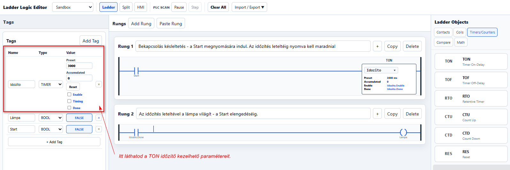
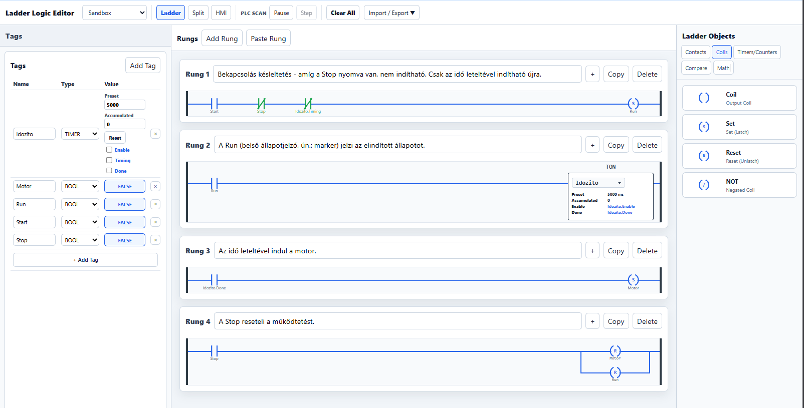

# 2. lecke – Időzítők

Ebben a leckében a **TON időzítő** működését tanuljuk meg egyszerű és összetettebb példán keresztül.

---

## 2.1 lecke – Késleltetett bekapcsolás TON időzítővel

### Feladat

Készíts olyan vezérlést, amelyben:

- a `Start` gomb megnyomására elindul az időzítés,
- **3 másodperc elteltével** bekapcsol egy lámpa vagy kimenet,
- ha a `Start` jelet az 5 másodperc letelte előtt megszünteted, az időzítő nullázódik,
- a kimenet csak akkor kapcsoljon be, ha az 5 másodperc ténylegesen letelt.

### Mit tanít ez?

Ebből a diák rögtön megérti:

- mi a **TON**, (Time On időzítő -> az idő leteltekor bekapcsol // késleltetés)
- mi a **preset idő**,
- mi történik időzítés közben,
- mi a **done bit**,
- miért nullázódik az időzítő, ha a feltétel megszűnik.

### Megoldás

### PLCPractice projektfájl -> lásd: lejjebb!

#### A projektfájl a szimulátorban megnyitható és a működés tesztelhető - de először próbáld létrehozni a kapcsolást a rajz alapján és próbáld ki!!!

---

## 2.2 – Késleltetett motorindítás

### Feladat

Készíts olyan vezérlést, amelyben:

- a `Start` gomb megnyomására elindul a vezérlés,
- **5 másodperc késleltetés után** bekapcsol a motor,
- a `Stop` gomb megnyomására a motor **azonnal leáll**,
- `Stop` után az időzítő is alaphelyzetbe kerül,
- újraindításkor ismét ki kell várni a 3 másodpercet.

### A működés sorrendje

1. `Start` → `Run` bekapcsol és öntartásba kerül.
2. `Run` elindítja a `T1` időzítőt.
3. 3 másodperc múlva `T1.DN = 1`.
4. Ekkor bekapcsol a `Motor`.
5. `Stop` megszakítja az öntartást.
6. A motor azonnal kikapcsol, az időzítő pedig nullázódik.

### Megoldás

### PLCPractice projektfájl -> görgess lejjebb!

### A projektfájl a szimulátorban megnyitható és a működés tesztelhető - de először próbáld létrehozni a kapcsolást a rajz alapján!!!

---

## Gyakorlás

👉 **[Nyisd meg a PLCPractice szimulátort](https://www.plcpractice.com/simulator), és építsd meg te is.**

## Próbáld meg önállóan!

Mielőtt megnézed vagy letöltöd a kész projektfájlt, **próbáld meg önállóan elkészíteni a kapcsolást a PLCPractice szimulátorban, majd próbáld ki a működését!**

Ne aggódj, ha elsőre nem sikerül! A hibakeresés és a próbálkozás a PLC-programozás megtanulásának fontos része.

### Elakadtál?

Ha nem sikerül megoldanod a feladatot, **[kérj segítséget a kapcsolati oldalon](https://plc-fanatic.webnode.hu/kapcsolat/)**.

Írd meg:

* melyik feladatnál akadtál el,
* mit szerettél volna elérni,
* mi történik helyette,
* és lehetőleg küldj egy **képernyőképet a kapcsolásodról**.

Így könnyebben meg tudjuk találni a hibát.

### Kész vagy? Működik a megoldásod? 

Ha elkészültél, vagy szeretnéd ellenőrizni a saját megoldásodat, töltsd le a **PLCPractice-ben betölthető projektfájlt**:

👉 [2.1 Projektfájl letöltése](kesl_ton.json)
👉 [2.2 Pjektfájl letöltése](kesl_motor.json)
