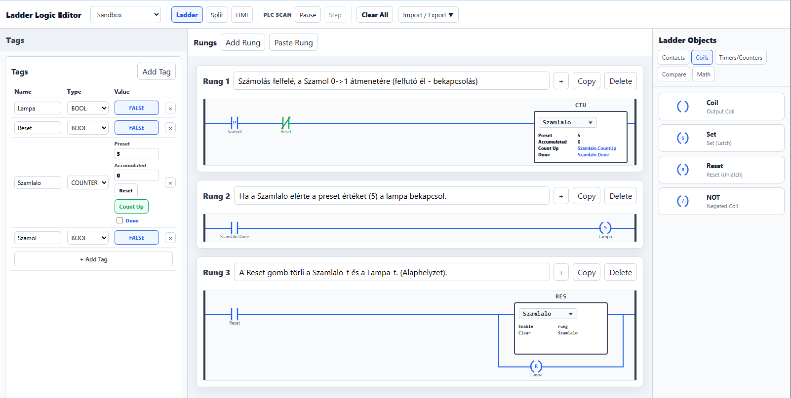
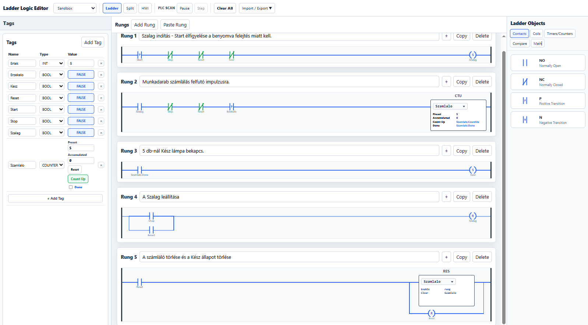

## 3.1 – Egyszerű számláló

### Feladat: készíts olyan vezérlést, amely egy nyomógomb megnyomásait számolja.

A Start gomb minden új megnyomása növelje a számlálót eggyel.
A számláló Preset értéke 5.
Az 5. megnyomás után kapcsoljon be a Lamp.
A Reset gomb nullázza a számlálót.
A Reset után a Lamp is kapcsoljon ki.
Egy gombnyomást csak egyszer szabad megszámolni, akkor is, ha a gombot a felhasználó nyomva tartja.

 #### Működés

A Start jelét felfutó éllel vizsgáljuk. Ez azért szükséges, mert a PLC ciklikusan hajtja végre a programot: egy folyamatosan nyomva tartott gomb több PLC-ciklusban is TRUE lehetne, miközben nekünk csak egy megnyomást kell számolnunk.

Start → [P] → CTU Szamlalo
                  Preset = 5

A számláló minden új Start-impulzusra eggyel növekszik:

1. megnyomás → 1
2. megnyomás → 2
3. megnyomás → 3
4. megnyomás → 4
5. megnyomás → 5 → Done = TRUE

A Done kimenettel kapcsoljuk a lámpát:

Szamlalo.Done → ( Lamp )

A Reset nullázza a számlálót és kikapcsolja a lámpát.

### Megoldás


---

## Gyakorlás

👉 **[Nyisd meg a PLCPractice szimulátort](https://www.plcpractice.com/simulator), és építsd meg te is.**
---

#### Letölthető PLCPractice projektfájl - az a program, amit a képen látsz -> görgess lejjebb!

##### A projektfájl a szimulátorban megnyitható és a működés tesztelhető - de először próbáld létrehozni a kapcsolást a rajz alapján!!!

---

<p align="center">
  👉 <a href="https://plc-fanatic.webnode.hu/kapcsolat"><b>Elakadtál? Itt kérdezhetsz.</b></a>
</p>

---

## 3.2 – Darabszámlálás szállítószalagon

### Feladat

Egy szállítószalagon érkező munkadarabokat számolunk. A szalag indítása és leállítása mellett a vezérlésnek a munkadarabok darabszámát is figyelnie kell.

A vezérlés működése:

- A `Start` gomb megnyomására induljon el a `Szalag`.
- A szalag működése közben az `Erzekelo` minden egyes munkadarab érkezését jelezze.
- Egy munkadarab érkezése **egyetlen számlálást** eredményezzen.
- A számláló elérésekor (`Preset = 5`) a `Done` kimenet jelezze, hogy elkészült a kívánt darabszám.
- A `Done` jel hatására kapcsoljon be a `Kesz` állapot, és álljon le a szalag.
- A `Stop` gomb bármikor leállíthatja a szalagot. A számláló értéke ilyenkor maradjon meg.
- A `Start` gombbal a folyamat újraindítható, és a számlálás az addig elért értékről folytatódjon.
- A `Reset` gomb új gyártási ciklust indít: a számláló álljon vissza `0` értékre, és a `Kesz` állapot törlődjön.

> **Megjegyzés:** A feladatban a `Preset` értéke 5 darab. Ez a szimuláció és a tesztelés miatt praktikus; valódi termelési feladatban természetesen más darabszám is beállítható.

---

### Egy lehetséges megoldás



### A működés elemzése

A vezérlés működését négy részre bonthatjuk.

#### 1. A szalag indítása

A `Start` gomb felfutó élére a `Szalag` bekapcsol.

Ez azért fontos, mert a `Start` gomb megnyomva tartása nem jelenthet folyamatos új indítási parancsot. A vezérlésnek az **új megnyomást**, vagyis a jel felfutó élét kell érzékelnie.

A `Stop` és a `Kesz` állapot megakadályozza a szalag indítását.

```text
Start → [P] → Stop → [/] → Kesz → [/] → (S) Szalag
```

#### 2. A munkadarabok számlálása

A szalag működése közben az Erzekelo érzékeli az érkező munkadarabokat.

Az érzékelő jele a CTU számláló bemenetére kerül, de felfutó él érzékelésével.

Szalag → [ ] → Erzekelo → [P] → CTU Szamlalo

Ennek jelentősége, hogy egy érzékelő előtt elhaladó munkadarab akár több PLC-cikluson keresztül is aktív jelet adhat. A számlálónak azonban ezt egy munkadarabként, egyszer kell értelmeznie.

A CTU számláló minden felfutó él hatására eggyel növeli az Accumulated értéket.

Például:

Munkadarab 1 → Accumulated = 1
Munkadarab 2 → Accumulated = 2
Munkadarab 3 → Accumulated = 3
Munkadarab 4 → Accumulated = 4
Munkadarab 5 → Accumulated = 5

#### 3. A kívánt darabszám elérése

A számláló Preset értéke ebben a feladatban 5.

Amikor az Accumulated eléri ezt az értéket, a számláló Done kimenete bekapcsol.

Szamlalo.Done → (S) Kesz

A Done kimenet használatával nem kell külön összehasonlító elemmel vizsgálnunk a számláló értékét.

A számláló tehát maga jelzi:

A beállított darabszám elkészült.

A Kesz állapot ezután leállítja a szalagot, és jelzi, hogy a kívánt darabszám elkészült.

#### 4. Stop és Reset

A két funkció szándékosan különbözik egymástól.

Stop:

A folyamatot megszakítja, de a számláló értékét nem törli.

Például ha a számláló értéke:

Accumulated = 3

és megnyomjuk a Stop gombot, akkor a szalag leáll, de:

Accumulated = 3

marad.

A következő Start után a számlálás a 3-as értékről folytatódhat.

Reset:

A Reset egy új számlálási ciklust készít elő.

Hatására:

Accumulated = 0 ; Kesz = OFF

#### Ezután a szalag újraindítható, és egy új gyártási ciklus kezdhető.

---

### Mit tanulunk ebből a feladatból?

A 3.1-es egyszerű számláló után itt ugyanazt a számlálási elvet alkalmazzuk egy életszerűbb PLC-feladatban.

A feladat fő tanulságai:

- a számláló (CTU) használata;
- a Preset érték használata;
- a számláló Done kimenetének figyelése;
- felfutó él érzékelése, hogy egy eseményt csak egyszer számoljunk;
- a folyamat és a számláló állapotának szétválasztása;
- a Stop és a Reset eltérő funkciója.

A lényeg nem az, hogy minél több PLC-elemet használjunk, hanem hogy lássuk:

A 3.1-ben megtanult számláló már nem önálló gyakorlatként, hanem egy vezérlési folyamat részeként is használható.

### PLCPractice projektfájl -> görgess lejjebb!

### A projektfájl a szimulátorban megnyitható és a működés tesztelhető - de először próbáld létrehozni a kapcsolást a rajz alapján!!!

---

## Gyakorlás

👉 **[Nyisd meg a PLCPractice szimulátort](https://www.plcpractice.com/simulator), és építsd meg te is.**
---

#### Letölthető PLCPractice projektfájl - az a program, amit a képen látsz -> görgess lejjebb!

##### A projektfájl a szimulátorban megnyitható és a működés tesztelhető - de először próbáld létrehozni a kapcsolást a rajz alapján!!!

---

<p align="center">
  👉 <a href="https://plc-fanatic.webnode.hu/kapcsolat"><b>Elakadtál? Itt kérdezhetsz.</b></a>
</p>

---


## Próbáld meg önállóan!

Mielőtt megnézed vagy letöltöd a kész projektfájlt, **próbáld meg önállóan elkészíteni a kapcsolást a PLCPractice szimulátorban, majd próbáld ki a működését!**

Ne aggódj, ha elsőre nem sikerül! A hibakeresés és a próbálkozás a PLC-programozás megtanulásának fontos része.

### Elakadtál?

Ha nem sikerül megoldanod a feladatot, **[kérj segítséget a kapcsolati oldalon](https://plc-fanatic.webnode.hu/kapcsolat/)**.

Írd meg:

* melyik feladatnál akadtál el,
* mit szerettél volna elérni,
* mi történik helyette,
* és lehetőleg küldj egy **képernyőképet a kapcsolásodról**.

Így könnyebben meg tudjuk találni a hibát.

---

### Kész vagy? Működik a megoldásod? 

Ha elkészültél, vagy szeretnéd ellenőrizni a saját megoldásodat, töltsd le a **PLCPractice-ben betölthető projektfájlt**:

👉 [3.1 Projektfájl letöltése](szlo_alap.json)
👉 [3.2 Pjektfájl letöltése](szlo_szalag.json)

---

Ha ***nem sikerül értelmezned a letöltött program működését*** vagy ***gondod van a PLCPractice szimulátor kezelésével***, szívesen segítek. 

<p align="center">
  👉 <a href="https://plc-fanatic.webnode.hu/kapcsolat"><b>Írj ide, ha kérdésed van!</b></a>
</p>

