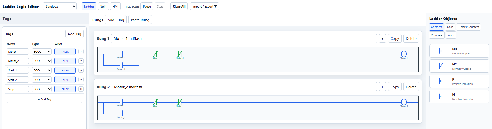
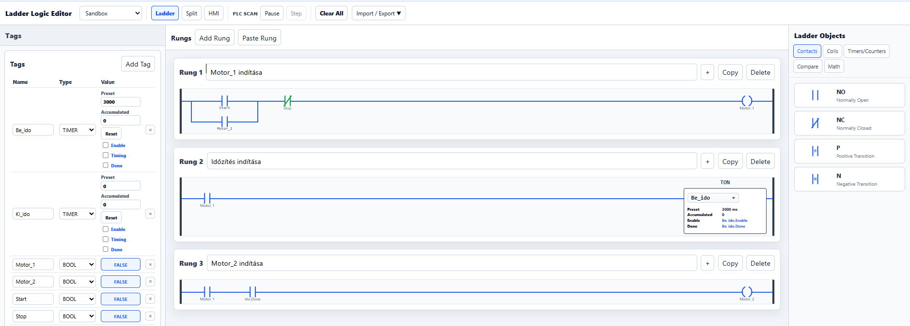

# 4. lecke – Reteszelés és sorrendi vezérlés

Ebben a leckében azt tanuljuk meg, hogyan lehet PLC-programban feltételekhez kötni egyes működéseket.

A reteszelés azt jelenti, hogy egy adott kimenet vagy folyamat csak akkor indulhat el, ha egy másik feltétel teljesül.

A sorrendi vezérlés esetén pedig a folyamatok nem egyszerre, hanem meghatározott sorrendben indulnak el.

---

## 4.1 – Két motor kölcsönös reteszelése

### Feladat

Készíts olyan vezérlést, amelyben két motor található:

- `Motor_1`
- `Motor_2`

A vezérlés működése:

- a `Start_1` gomb megnyomására induljon el a `Motor_1`,
- a `Start_2` gomb megnyomására induljon el a `Motor_2`,
- a két motor **ne működhessen egyszerre**,
- ha a `Motor_1` működik, a `Motor_2` ne legyen elindítható,
- ha a `Motor_2` működik, a `Motor_1` ne legyen elindítható,
- a `Stop` gomb megnyomására mindkét motor álljon le,
- Stop után bármelyik motor újraindítható legyen.

> **Megjegyzés:** A valódi ipari berendezésekben gyakran szükséges, hogy két egymással ellentétes vagy egymást zavaró működés ne történhessen meg egyszerre. Ilyen lehet például egy előre–hátra forgó motor, két irányú szállítószalag, vagy két, ugyanazt a munkaterületet használó gépegység.

---

### Mit tanít ez?

Ebből a feladatból megérted:

- mit jelent a **reteszelés** PLC-programban,
- hogyan akadályozhatjuk meg két kimenet egyidejű működését,
- hogyan használható az egyik kimenet állapota feltételként a másik kimenet indításánál,
- hogyan épül fel az öntartás reteszeléssel együtt,
- miért fontos a Stop funkció minden működő kimenet számára.

---

### A működés elve

A két motor indítása öntartással történik.

A `Motor_1` csak akkor indulhat el, ha a `Motor_2` nem működik.

A `Motor_2` csak akkor indulhat el, ha a `Motor_1` nem működik.

A reteszeléshez az egyik motor kikapcsolt állapotát vizsgáljuk a másik motor indítási feltételében.

Például a `Motor_1` indításánál:

```text
Start_1 → [ ] → Motor_2 → [/] → (S) Motor_1
```

A `Motor_2` indításánál:

```text
Start_2 → [ ] → Motor_1 → [/] → (S) Motor_2
```

A `[/]` kontaktus azt jelenti, hogy az adott feltételnek kikapcsolt állapotban kell lennie.

Tehát a `Motor_1` csak akkor indulhat el, ha a `Motor_2 = OFF`.

Ugyanez fordítva is igaz:

A `Motor_2` csak akkor indulhat el, ha a `Motor_1 = OFF`.

---

### Egy lehetséges működési példa

1. Kezdetben mindkét motor kikapcsolt állapotban van.

```text
Motor_1 = OFF
Motor_2 = OFF
```

2. Megnyomjuk a `Start_1` gombot.

```text
Motor_1 = ON
Motor_2 = OFF
```

3. Ezután megnyomjuk a `Start_2` gombot.

A `Motor_2` nem indulhat el, mert a `Motor_1` már működik.

```text
Motor_1 = ON
Motor_2 = OFF
```

4. Megnyomjuk a `Stop` gombot.

```text
Motor_1 = OFF
Motor_2 = OFF
```

5. Most már megnyomható a `Start_2` gomb.

```text
Motor_1 = OFF
Motor_2 = ON
```

A két motor tehát nem működhet egyszerre.

---

### Megoldás



### PLCPractice projektfájl -> lásd: lejjebb!

#### A projektfájl a szimulátorban megnyitható és a működés tesztelhető - de először próbáld létrehozni a kapcsolást a rajz alapján és próbáld ki!!!

---

## 4.2 – Kétmotoros indítási sorrend

### Feladat

Készíts olyan vezérlést, amelyben két motor meghatározott sorrendben indul el.

A vezérlés működése:

- a `Start` gomb megnyomására induljon el a `Motor_1`,
- a `Motor_1` elindulása után induljon el egy időzítés,
- **3 másodperc elteltével** induljon el a `Motor_2`,
- a `Motor_2` csak akkor működhessen, ha a `Motor_1` már működik,
- a `Stop` gomb megnyomására mindkét motor azonnal álljon le,
- Stop után az időzítő is álljon vissza alaphelyzetbe,
- újraindításkor ismét először a `Motor_1` induljon el,
- a `Motor_2` csak az újabb 3 másodperces késleltetés után indulhasson el.

> **Megjegyzés:** Ez a feladat egy egyszerű indítási sorrendet mutat be. Valódi berendezésekben gyakori, hogy egy segédberendezésnek vagy előkészítő egységnek előbb el kell indulnia, és csak utána kapcsolható be a következő gépegység.

---

### A működés sorrendje

1. A `Start` gomb megnyomására a vezérlés elindul.

2. A `Motor_1` bekapcsol és öntartásba kerül.

3. A `Motor_1` működése elindítja az `Idozito` TON időzítőt.

4. Az időzítő 3 másodpercig számol.

5. Amikor az időzítő eléri a beállított időt:

```text
Idozito.Done = TRUE
```

6. Az `Idozito.Done` jel bekapcsolja a `Motor_2` kimenetet.

7. A `Stop` gomb megnyomására a `Motor_1` és a `Motor_2` is leáll.

8. A `Motor_1` kikapcsolása miatt az időzítő bemeneti feltétele megszűnik, ezért az időzítő nullázódik.

9. Újraindításkor ismét ki kell várni a 3 másodpercet a `Motor_2` indulásáig.

---

### A működés elemzése

A vezérlés három fő részből áll.

#### 1. A Motor_1 indítása

A `Start` gomb megnyomására a `Motor_1` bekapcsol.

A motor a korábban megismert öntartással működik tovább, ezért a Start gomb elengedése után sem áll le.

```text
Start → [ ] → Stop → [/] → (S) Motor_1
```

A Stop megnyomása megszünteti a motor működését.

---

#### 2. Az időzítő indítása

A TON időzítő akkor indul el, amikor a `Motor_1` működik.

```text
Motor_1 → [ ] → TON Idozito
```

Az időzítő Preset értéke:

```text
3 másodperc
```

Amíg a `Motor_1` bekapcsolt állapotban van, az időzítő számolja az időt.

Ha a Motor_1 leáll, az időzítő nullázódik.

---

#### 3. A Motor_2 indítása

A `Motor_2` csak akkor indulhat el, ha az időzítés már lejárt.

```text
Motor_1 → [ ] → Idozito.Done → [ ] → ( ) Motor_2
```

Ennek két fontos feltétele van:

- a `Motor_1` működjön,
- az `Idozito.Done` értéke legyen TRUE.

Ez biztosítja, hogy a Motor_2 ne indulhasson el a Motor_1 előtt.

Ha a `Motor_1` leáll, a `Motor_2` is azonnal kikapcsol.

---

### Egy lehetséges működési példa

Kezdeti állapot:

```text
Motor_1 = OFF
Motor_2 = OFF
Idozito.Done = FALSE
```

A `Start` gomb megnyomása után:

```text
Motor_1 = ON
Motor_2 = OFF
Idozito elindul
```

1 másodperc elteltével:

```text
Motor_1 = ON
Motor_2 = OFF
Idozito fut
```

3 másodperc elteltével:

```text
Motor_1 = ON
Motor_2 = ON
Idozito.Done = TRUE
```

A `Stop` gomb megnyomása után:

```text
Motor_1 = OFF
Motor_2 = OFF
Idozito.Done = FALSE
```

---

### Mit tanulunk ebből a feladatból?

A feladatban több korábban megismert PLC-elemet kapcsolunk össze.

A fő tanulságok:

- az öntartás használata;
- a TON időzítő alkalmazása;
- az időzítő Done kimenetének használata;
- feltételhez kötött motorindítás;
- egyszerű sorrendi vezérlés;
- a Motor_2 működésének függővé tétele a Motor_1 állapotától;
- Stop esetén minden kapcsolódó működés leállítása;
- az időzítő automatikus nullázódása.

A lényeg az, hogy a `Motor_2` nem önállóan indul el.

A Motor_2 csak akkor működhet, ha:

```text
Motor_1 = ON
ÉS
Idozito.Done = TRUE
```

---

### Megoldás



### PLCPractice projektfájl -> görgess lejjebb!

#### A projektfájl a szimulátorban megnyitható és a működés tesztelhető - de először próbáld létrehozni a kapcsolást a rajz alapján és próbáld ki!!!

---

## Gyakorlás

👉 **[Nyisd meg a PLCPractice szimulátort](https://www.plcpractice.com/simulator), és építsd meg te is.**

---

## Próbáld meg önállóan!

Mielőtt megnézed vagy letöltöd a kész projektfájlt, **próbáld meg önállóan elkészíteni a kapcsolásokat a PLCPractice szimulátorban, majd próbáld ki a működésüket!**

Először készítsd el a 4.1-es feladatot, és ellenőrizd, hogy a két motor valóban nem indulhat el egyszerre.

Ezután készítsd el a 4.2-es feladatot, és figyeld meg, hogy a Motor_2 csak a beállított késleltetési idő letelte után indulhat el.

Ne aggódj, ha elsőre nem sikerül! A hibakeresés és a próbálkozás a PLC-programozás megtanulásának fontos része.

### Elakadtál?

Ha nem sikerül megoldanod a feladatot, **[kérj segítséget a kapcsolati oldalon](https://plc-fanatic.webnode.hu/kapcsolat/)**.

Írd meg:

* melyik feladatnál akadtál el,
* mit szerettél volna elérni,
* mi történik helyette,
* és lehetőleg küldj egy **képernyőképet a kapcsolásodról**.

Így könnyebben meg tudjuk találni a hibát.

---

### Kész vagy? Működik a megoldásod?

Ha elkészültél, vagy szeretnéd ellenőrizni a saját megoldásodat, töltsd le a **PLCPractice-ben betölthető projektfájlokat**:

👉 [4.1 Projektfájl letöltése](reteszeles_alap.json)

👉 [4.2 Projektfájl letöltése](motor_sorrend.json)

---

Ha ***nem sikerül értelmezned a letöltött program működését*** vagy ***gondod van a PLCPractice szimulátor kezelésével***, szívesen segítek.

<p align="center">
  👉 <a href="https://plc-fanatic.webnode.hu/kapcsolat"><b>Írj ide, ha kérdésed van!</b></a>
</p>
