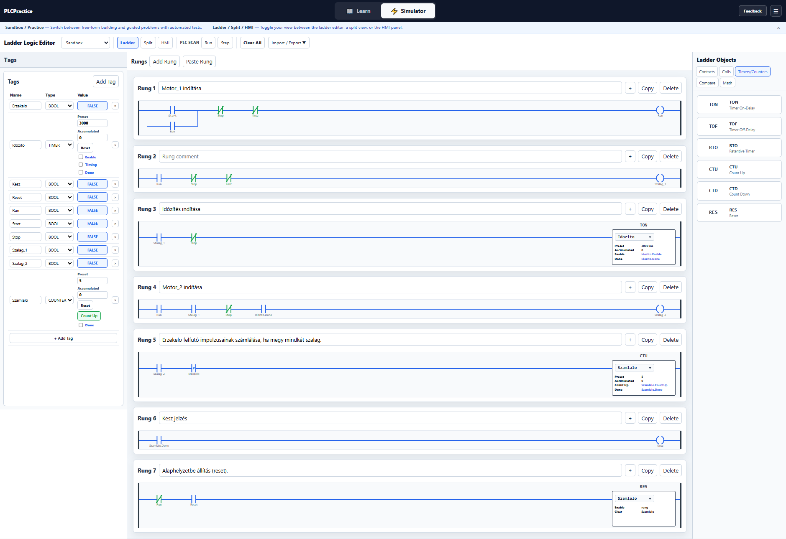

# 5. lecke – Összetett gyakorlófeladat

Ebben a leckében az eddig megismert PLC-elemeket együtt használjuk egy összetettebb vezérlési feladatban.

A feladatban szerepelni fog:

- Start–Stop vezérlés és öntartás,
- TON időzítő,
- számláló,
- felfutó él érzékelése,
- reteszelés,
- sorrendi vezérlés,
- kész állapot jelzése,
- Reset funkció.

---

## 5.1 – Automatikus két szállítószalagos gyűjtőállomás

### Feladat

Készíts olyan vezérlést, amely két szállítószalagot vezérel.

A vezérlés működése:

- a `Start` gomb megnyomására induljon el a folyamat,
- a `Szalag_1` azonnal induljon el,
- a `Szalag_1` indulása után kezdődjön el egy időzítés,
- **3 másodperc elteltével** induljon el a `Szalag_2`,
- a `Szalag_2` csak akkor működhessen, ha a `Szalag_1` már működik,
- az `Erzekelo` minden új munkadarab érkezését jelezze,
- egy munkadarabot csak egyszer szabad megszámolni,
- a számláló Preset értéke legyen `5`,
- az 5. munkadarab után kapcsoljon be a `Kesz` jelzés,
- a `Kesz` állapot hatására mindkét szállítószalag álljon le,
- a `Stop` gomb bármikor állítsa le a folyamatot,
- Stop után a számláló értéke maradjon meg,
- a `Reset` gomb nullázza a számlálót és készítsen elő egy új gyártási ciklust.

> **Megjegyzés:** A feladatban a Preset érték 5 darab. Ez a szimuláció és tesztelés miatt praktikus. Valódi berendezésben természetesen ettől eltérő darabszám is beállítható.

---

### Mit tanít ez?

Ebből a feladatból megérted:

- hogyan használható az öntartás egy teljes folyamat működtetésére;
- hogyan indítható két motor egymás után;
- hogyan használható a TON időzítő sorrendi vezérlésben;
- hogyan akadályozható meg, hogy a `Szalag_2` a `Szalag_1` nélkül működjön;
- hogyan számolható egy érzékelő jelével egy munkadarab;
- miért szükséges felfutó él érzékelése;
- hogyan jelez a CTU számláló Done kimenete;
- hogyan állítható le automatikusan egy folyamat a kívánt darabszám elérésekor;
- mi a különbség a Stop és a Reset funkció között.

---

### A vezérlés működése

1. A `Start` gomb megnyomására a `Folyamat` állapot bekapcsol.

2. A `Folyamat` öntartásba kerül, ezért a Start gomb elengedése után is aktív marad.

3. A `Folyamat` hatására azonnal elindul a `Szalag_1`.

4. A `Szalag_1` működése elindítja az `Idozito` TON időzítőt.

5. Az időzítő 3 másodpercig számol.

6. Amikor az időzítő lejár:

```text
Idozito.Done = TRUE
```

7. Ekkor elindulhat a `Szalag_2`.

8. A `Szalag_2` működése közben az `Erzekelo` minden új munkadarabot érzékel.

9. Az `Erzekelo` felfutó élére a `Szamlalo` értéke eggyel növekszik.

10. Amikor a számláló eléri az 5-ös Preset értéket:

```text
Szamlalo.Done = TRUE
```

11. A `Szamlalo.Done` jel bekapcsolja a `Kesz` állapotot.

12. A `Kesz` állapot leállítja a `Szalag_1` és `Szalag_2` működését.

13. A `Stop` gomb bármikor leállíthatja a folyamatot, de a számláló értéke megmarad.

14. A `Reset` gomb új gyártási ciklust készít elő:

```text
Szamlalo.Accumulated = 0
Kesz = OFF
```

---

### Megoldás



### PLCPractice projektfájl -> görgess lejjebb!

#### A projektfájl (ez a ladder program, amit itt látsz a képen) a szimulátorban megnyitható és a működés tesztelhető - de először próbáld létrehozni a kapcsolást a rajz alapján és próbáld ki a működését!

<p align="center">
  👉 <a href="https://plc-fanatic.webnode.hu/kapcsolat"><b>Írj ide, ha valami nem sikerül, vagy kérdésed van!</b></a>
</p>

---

### A működés elemzése

A vezérlés működését hét részre bonthatjuk.

#### 1. A folyamat indítása és öntartása

A `Start` gomb elindítja a `Folyamat` állapotot.

A `Folyamat` saját kontaktusa párhuzamosan kapcsolódik a Start gombbal, ezért a Start elengedése után is fenntartja a működést.

A `Stop` és a `Kesz` állapot megszakítja az öntartást.

```text
             ┌── Start ─────┐
             │              │
Folyamat:    ├── Folyamat ──┤── Stop → [/] ── Kesz → [/] ── ( Folyamat )
             │              │
             └──────────────┘
```

A `Folyamat` csak akkor maradhat aktív, ha:

```text
Stop = OFF
ÉS
Kesz = OFF
```

---

#### 2. Az első szállítószalag működése

A `Szalag_1` akkor működik, ha a folyamat aktív, és még nem készült el az előírt darabszám.

```text
Folyamat → [ ] → Kesz → [/] → ( Szalag_1 )
```

Amikor a `Kesz` jel bekapcsol, a Szalag_1 leáll.

---

#### 3. Az időzítő indítása

A `Szalag_1` működése indítja el az `Idozito` TON időzítőt.

```text
Szalag_1 → [ ] → TON Idozito
Preset = 3 másodperc
```

Amíg a Szalag_1 működik, az időzítő számolja az időt.

Ha a Szalag_1 megáll, az időzítő nullázódik.

---

#### 4. A második szállítószalag indítása

A `Szalag_2` csak akkor indulhat el, ha:

```text
Szalag_1 = ON
ÉS
Idozito.Done = TRUE
ÉS
Kesz = OFF
```

A Ladder-logika:

```text
Szalag_1 → [ ] → Idozito.Done → [ ] → Kesz → [/] → ( Szalag_2 )
```

Ez egyben reteszelés is.

A `Szalag_2` nem működhet a `Szalag_1` nélkül.

---

#### 5. A munkadarabok számlálása

A `Szalag_2` működése közben az `Erzekelo` jele számlálja a munkadarabokat.

Az érzékelő jelét felfutó éllel kell vizsgálni.

```text
Szalag_2 → [ ] → Erzekelo → [P] → CTU Szamlalo
Preset = 5
```

Ez azért fontos, mert egy munkadarab az érzékelő előtt több PLC-cikluson keresztül is aktív jelet adhat.

Nekünk azonban ezt csak egyetlen munkadarabként szabad értelmeznünk.

Példa:

```text
1. munkadarab → Accumulated = 1
2. munkadarab → Accumulated = 2
3. munkadarab → Accumulated = 3
4. munkadarab → Accumulated = 4
5. munkadarab → Accumulated = 5
```

---

#### 6. A kész állapot és automatikus leállítás

Amikor a számláló eléri a Preset értéket:

```text
Szamlalo.Done = TRUE
```

A számláló Done kimenete kapcsolja a `Kesz` jelzést.

```text
Szamlalo.Done → [ ] → ( Kesz )
```

A `Kesz` állapot a korábbi hálózatokban NC kontaktusként szerepel.

Ezért a Kesz jel automatikusan megszakítja a szállítószalagok működését.

```text
Kesz = ON
→ Szalag_1 = OFF
→ Szalag_2 = OFF
→ Folyamat = OFF
```

---

#### 7. Stop és Reset

A Stop és Reset funkciók eltérő feladatot látnak el.

Stop:

A Stop a folyamatot állítja le.

```text
Folyamat = OFF
Szalag_1 = OFF
Szalag_2 = OFF
```

A számláló értéke megmarad.

Például:

```text
Szamlalo.Accumulated = 3
```

A Stop után újraindítható a folyamat, és a számlálás a 3-as értékről folytatódik.

Reset:

A Reset új gyártási ciklust készít elő.

```text
Reset → [ ] → RES Szamlalo
```

A Reset hatására:

```text
Szamlalo.Accumulated = 0
Szamlalo.Done = FALSE
Kesz = OFF
```

A Resetet célszerű leállított folyamatnál használni.

---

### Mit tanulunk ebből a feladatból?

Ebben a feladatban az eddig megismert PLC-elemek együtt működnek.

A fő tanulságok:

- Start–Stop vezérlés és öntartás;
- TON időzítő használata;
- sorrendi motorindítás;
- reteszelés;
- CTU számláló használata;
- felfutó él érzékelése;
- Preset és Done értékek kezelése;
- automatikus leállítás;
- Stop és Reset eltérő működése;
- egy teljes, egyszerű automatizálási folyamat felépítése.

A lényeg nem az, hogy minél több elemet helyezzünk el a Ladder-programban.

A lényeg az, hogy minden PLC-elemnek jól meghatározott szerepe legyen a folyamatban.

---

## Gyakorlás

👉 **[Nyisd meg a PLCPractice szimulátort](https://www.plcpractice.com/simulator), és építsd meg te is.**

---

## Próbáld meg önállóan!

Mielőtt megnézed vagy letöltöd a kész projektfájlt, **próbáld meg önállóan elkészíteni a kapcsolást a PLCPractice szimulátorban, majd próbáld ki a működését!**

Először csak a `Folyamat` öntartását készítsd el.

Ezután add hozzá a `Szalag_1` vezérlését.

A következő lépésben építsd be az `Idozito` TON időzítőt.

Ezután készítsd el a `Szalag_2` késleltetett indítását.

Végül add hozzá az `Erzekelo`, a `Szamlalo`, a `Kesz` és a `Reset` funkciókat.

Ne aggódj, ha elsőre nem sikerül! A hibakeresés és a próbálkozás a PLC-programozás megtanulásának fontos része.

### Elakadtál?

Ha nem sikerül megoldanod a feladatot, **[kérj segítséget a kapcsolati oldalon](https://plc-fanatic.webnode.hu/kapcsolat/)**.

Írd meg:

* melyik feladatnál akadtál el,
* mit szerettél volna elérni,
* mi történik helyette,
* és lehetőleg küldj egy **képernyőképet a kapcsolásodról**.

Így könnyebben meg tudjuk találni a hibát.

---

### Kész vagy? Működik a megoldásod?

Ha elkészültél, vagy szeretnéd ellenőrizni a saját megoldásodat, töltsd le a **PLCPractice-ben betölthető projektfájlt**:

👉 [5.1 Projektfájl letöltése](osszetett_gyakorlat.json)

---

Ha ***nem sikerül értelmezned a letöltött program működését*** vagy ***gondod van a PLCPractice szimulátor kezelésével***, szívesen segítek.

<p align="center">
  👉 <a href="https://plc-fanatic.webnode.hu/kapcsolat"><b>Írj ide, ha kérdésed van!</b></a>
</p>
