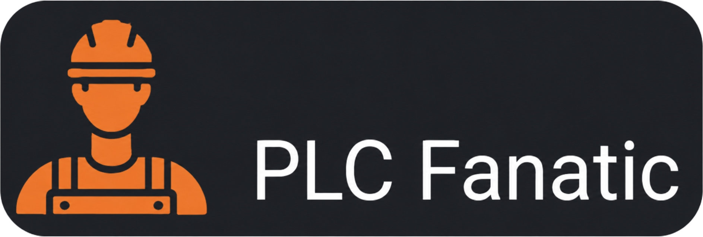

  

 

# PLC Fanatic – PLC programozás kezdőknek

Magyar nyelvű, **gyakorlatorientált PLC-oktatóanyag kezdőknek**.

A tananyag a **PLCPractice** online PLC-szimulátorra épül, és lépésről lépésre vezet végig az alapvető létradiagram-programozási feladatokon.

## Kinek szól?

Elsősorban azoknak, akik most ismerkednek a PLC-programozással, és szeretnék a létradiagramos alapokat egyszerű, gyakorlati feladatokon keresztül megtanulni.

## Hogyan használd?

Olvasd el az adott lecke rövid magyarázatát, nézd meg a kapcsolás működését, majd próbáld meg önállóan felépíteni a programot a PLCPractice szimulátorban.

## Tananyag

1. **Start–Stop és öntartás**
   Az alapvető indító–leállító vezérlés és az öntartás működése.

2. **Időzítők**
   Késleltetett be- és kikapcsolási feladatok.

3. **Számlálók**
   Események számlálása és számlálóértékek kezelése.

4. **Reteszelés és sorrendi vezérlés**
   Feltételekhez kötött működés és egyszerű lépéssorok.

5. **Összetett gyakorlófeladat**
   Több korábban megtanult elem együttes alkalmazása.

## Gyakorlás

👉 **[Nyisd meg a PLCPractice szimulátort](https://www.plcpractice.com/simulator), és építsd meg te is.**
